= Documentació del Projecte
:toc:
:toc-title: Índex de continguts

== 1. Documentació Tècnica

=== 1.1 Justificació de decisions de disseny o implementació

==== 1.1.1 Decisions d'arquitectura

Pel que fa a l'arquitectura del projecte, no s'ha considerat necessari realitzar cap modificació respecte al model proposat en l'exemple proporcionat pel professorat en el document inicial.

==== 1.1.2 Decisions d'implementació

En relació amb la implementació, no ha estat necessari realitzar modificacions significatives, ja que el desenvolupament s'ha dut a terme seguint les indicacions i requisits definits a l'enunciat del projecte.

=== 1.2 Llista final de requeriments implementats

==== 1.2.1 Requeriments funcionals implementats

[cols="1,1,4"]
|===
| ID | Categoria | Descripció

| RF01
| Client
| Login. El sistema ha de permetre que un usuari activat pugui iniciar sessió a l’aplicació amb el seu correu electrònic i contrasenya.

| RF03
| Client
| Recuperar contrasenya. El sistema ha de permetre que l’usuari pugui recuperar la contrasenya en cas d’oblit.

| RF04
| Client
| Editar perfil usuari. El sistema ha de permetre que l’usuari pugui modificar totes les dades del seu perfil, inclosa la seva foto i la seva documentació.

| RF05
| Client
| Logout. El sistema ha de permetre que l’usuari pugui tancar la sessió.

| RF50
| Reserva
| Alta de reserva. El sistema ha de permetre que el client pugui donar d’alta una nova reserva.

| RF51
| Reserva
| Llistat reserves. El sistema ha de permetre que el client pugui llistar les reserves pròpies.

| RF52
| Reserva
| Ordenar reserves per data inici. El sistema ha de permetre que el client pugui ordenar les reserves pròpies per data d’inici de la reserva ja sigui de manera ascendent o descendent.

| RF53
| Reserva
| Veure el detall d’una reserva en una pantalla específica. El sistema de permetre que el client pugui veure tota la informació de la reserva pròpia seleccionada inclòs les dades del cotxe amb la foto en una pantalla independent de la pantalla anterior.

| RF55
| Reserva
| Anul·lar reserva. L’aplicació ha de permetre anul·lar una reserva pròpia només abans que s'iniciï.

| RF02
| Client anònim
| Registre. El sistema ha de permetre que una persona anònima pugui registrar-se com a usuari client per poder utilitzar l’app.

| RF90
| Client anònim
| Llistar vehicles. El sistema ha de permetre que l’usuari pugui llistar els vehicles.

| RF91
| Client anònim
| Veure el detall d’un vehicle. El sistema de permetre que l’usuari pugui veure tota la informació del vehicle seleccionat.

| RF92
| Client anònim
| Ordenar vehicles per preu. El sistema ha de permetre que l’usuari pugui llistar els vehicles ordenats per preu de forma ascendent / descendent.

| RF56
| Client anònim
| Consultar disponibilitat de vehicles per rang de dates. El sistema ha de permetre que l’usuari pugui consultar, en un determinat període, els vehicles que estiguin disponibles per a reservar.

|===

==== 1.2.2 Requeriments no implementats

Durant el desenvolupament del projecte s’han pogut implementar tots els requeriments funcionals definits inicialment. Per tant, no ha quedat cap requeriment funcional sense implementar.

Tot i així, a causa de les limitacions de temps durant els diferents sprints, no ha estat possible dedicar tot el temps desitjat a la millora d’alguns aspectes visuals de l’aplicació. En particular, ens hauria agradat dedicar més temps a polir el disseny de determinades pantalles, com ara la pantalla de crear una reserva, i millorar alguns elements de la interfície d’usuari per tal d’oferir una experiència d’ús encara més cuidada.

Malgrat això, totes les funcionalitats previstes han estat implementades correctament i el sistema compleix amb els requeriments funcionals establerts en l’enunciat del projecte.

=== 1.3 Desviacions respecte a la planificació inicial

Durant el desenvolupament del projecte no s’han produït canvis significatius respecte a la planificació inicial establerta a l’inici del projecte. Les tasques es van repartir entre els membres de l’equip des del principi i aquesta distribució s’ha mantingut al llarg dels diferents sprints.

Cada membre de l’equip ha treballat principalment en les funcionalitats que s’havien assignat inicialment, fet que ha permès mantenir una organització estable del treball i seguir la planificació prevista.

Tot i això, durant el desenvolupament sí que han aparegut algunes dificultats en el moment d’integrar el codi al repositori, especialment relacionades amb conflictes de *merge* entre diferents branques. Aquestes incidències han requerit dedicar temps addicional a la resolució de conflictes i a la coordinació entre membres de l’equip per assegurar que totes les funcionalitats funcionessin correctament un cop integrades.

=== 1.4 Incidències trobades durant el desenvolupament

==== 1.4.1 Problemes tècnics

Durant el desenvolupament del projecte no s’han detectat problemes tècnics rellevants relacionats amb el llenguatge de programació ni amb els frameworks utilitzats. Les tecnologies emprades han funcionat de manera estable i han permès implementar les funcionalitats previstes sense incidències destacables.

La major part de les dificultats trobades durant el desenvolupament han estat més relacionades amb aspectes d’entorn o amb la gestió del repositori, com ara els conflictes de *merge* o alguns problemes puntuals amb l’emulador d’Android, que no pas amb la implementació tècnica del sistema.

==== 1.4.2 Problemes amb eines o entorn

===== Conflictes de merge en el repositori

Durant el desenvolupament del projecte s’han produït diversos conflictes de *merge* en el repositori Git. Aquests conflictes han aparegut principalment quan diferents membres de l’equip treballaven simultàniament en fitxers relacionats amb les mateixes funcionalitats.

En alguns casos això ha provocat la necessitat de revisar manualment el codi i integrar els canvis per assegurar que totes les funcionalitats continuessin funcionant correctament. Tot i que aquestes incidències han requerit dedicar temps addicional, també han permès millorar la coordinació de l’equip i adquirir més experiència en la gestió del control de versions.

===== Problemes amb l’emulador d’Android

Durant el desenvolupament de l’aplicació també s’han produït incidències amb l’emulador d’Android utilitzat per provar l’aplicació. En diverses ocasions l’emulador es quedava congelat o deixava de respondre correctament.

Quan això passava, era necessari reiniciar completament l’emulador mitjançant un *cold boot* per tal que tornés a funcionar amb normalitat. Aquestes situacions han provocat petites interrupcions durant el desenvolupament, ja que obligaven a reiniciar l’entorn de proves abans de continuar treballant.

== 2. Documentació General

=== SPRINT - 1

==== 1. Planificació Inicial

===== Board inicial — Eric Delgado López
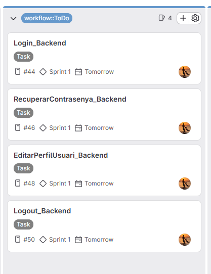

===== Board inicial — Oriol Jové Naranjo
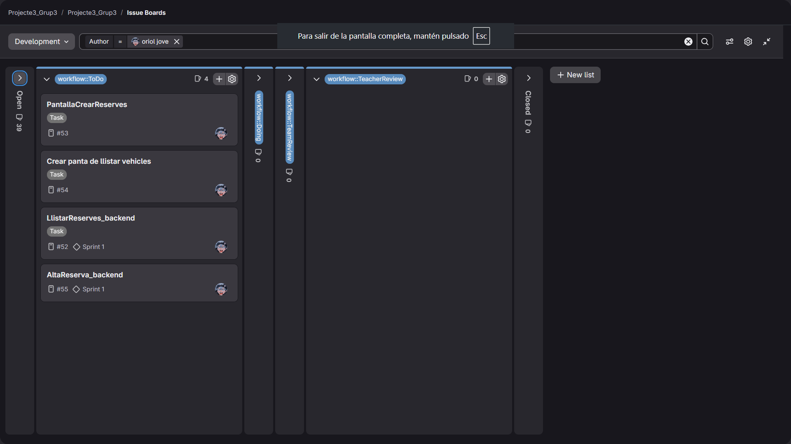

===== Board inicial — Darren Escosio Leones
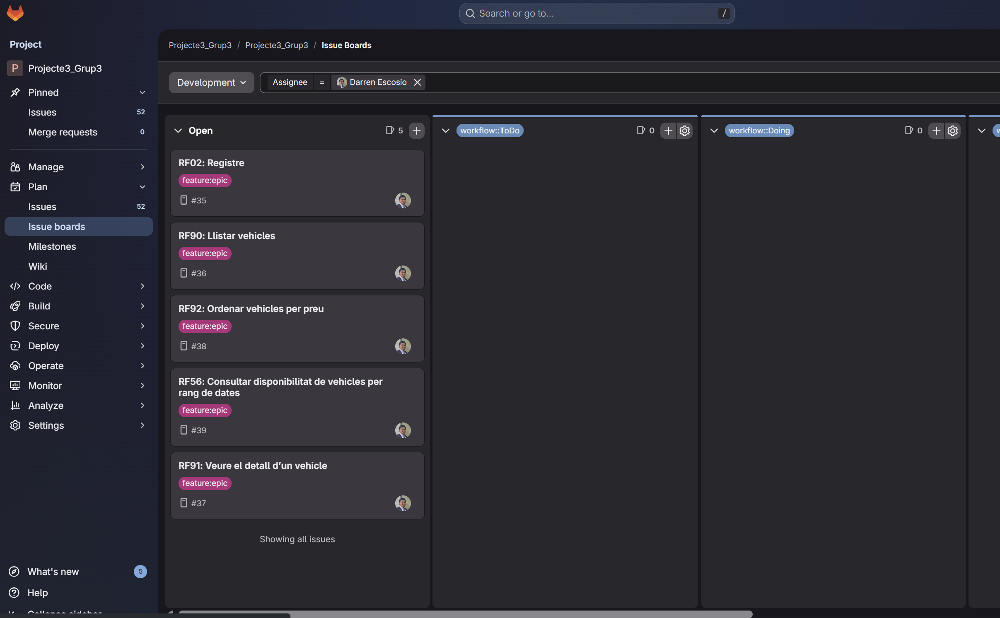

==== 2. Daily Stand Ups

=== DIA 1 - 13/02
[cols="1,2,2,2,1", options="header"]
|===
| Membre | Què va fer ahir | Què farà avui | Problemes | Hores
| Eric Delgado | Es va fer teoria fins ahir | Mirar l'enunciat i consultat dubtes, es va començar a organitzar els rols i la feina del grup | No hi ha molt temps per aquest sprint | 3h 
| Oriol Jové | Es va fer teoria | Llegir l'enunciat i resoldre els dubtes que apereguin i organitzar el començament del projecte | El poc temps d'aquest sprint | 3h
| Darren Escosio | Es va fer teoria | Mira l'enunciat i fer plans per començar el projecte | No ha hagut temps per fer molt | 3h
|===

=== DIA 2 - 17/02
[cols="1,2,2,2,1", options="header"]
|===
| Membre | Què va fer ahir | Què farà avui | Problemes | Hores
| Eric Delgado | Vaig llegir l'enunciat i vaig entendre gran part de l'enunciat | Realment no faré res perquè treballaré i descansaré per poder començar el projecte dimecres | Tenir poc temps per fer aquest sprint | 0h
| Oriol Jové | Es va llegir l'enunciat i organitzar una mica la feina del projecte, creació del projecte al git amb tota la part de SCRUM | He llegit el document d'arquitectura per a Android i no he entès gaire | Arquitectura a Android | 2h
| Darren Escosio | Llegir l'enunciat per entendre-ho | Investigar i començar el AsciiDoc | Cap | 2h
|===
=== DIA 3 - 18/02
[cols="1,2,2,2,1", options="header"]
|===
| Membre | Què va fer ahir | Què farà avui | Problemes | Hores
| Eric Delgado |Vaig treballar i descansar |Organitzar-me amb el meu grup per saber que RF farè en aquest projecte i començar a fer alguna cosa de backend |Tenir poc temps per  fer aquest sprint | 2'30h + 5 h
| Oriol Jové |Llegir el document d'arquitectura Android | Començar a fer funcions al backend de reserves | Cap | 3h + 2h
| Darren Escosio | començar el AsciiDoc | Terminar la plantilla d'AsciiDoc i començar amb el backend i frontend de llistar vehicles a Android Studio| Cap| 3+1:30h
|===

=== DIA 4 - 19/02
[cols="1,2,2,2,1", options="header"]
|===
| Membre | Què va fer ahir | Què farà avui | Problemes | Hores
| Eric Delgado |Ahir vaig adelantar moltisim la part de backend i vaig afegir el javadoc de les noves clases | començar amb l'Android Studio Code a fer la part de presentació al client |Que surtin errors a l'últim moment  | 4H 
| Oriol Jové | La creació de la funcionalitat al backend de crear reserves | La funcionalitat de llistar les reserves de cada client i pantalles a l'Android Studio | Cap  | 4h
| Darren Escosio |Començar el backend i fontend de llistar vehicles | Completar el frontend de llistar vehicles a Android Studio i començar el frontend de veure detalls de vehicles | Cap | 4 + 1h
|===

=== 3. Planificació Final

==== Board final — Grup 3
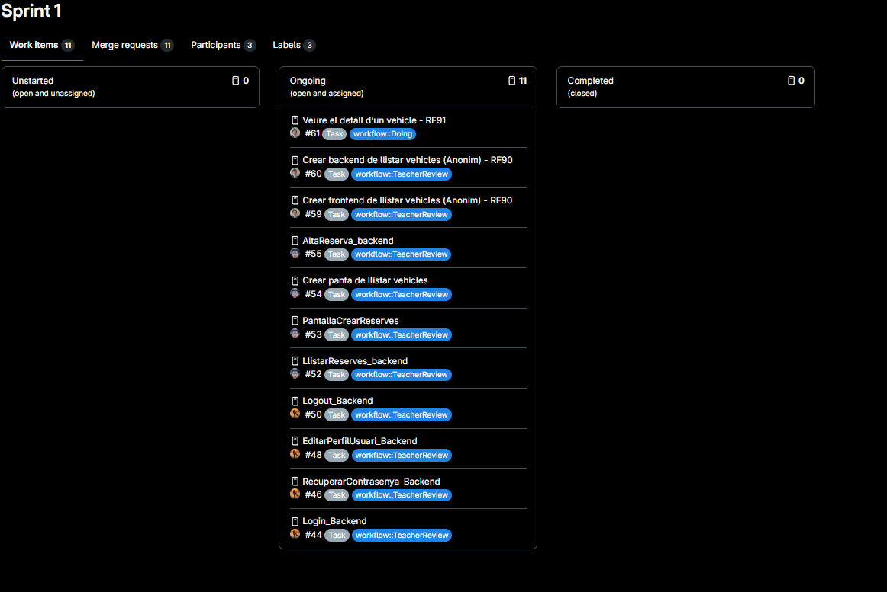

= SPRINT - 2

== 1. Planificació Inicial

=== 1.1. Planificació (Inicial)
==== Board inicial — Eric Delgado López
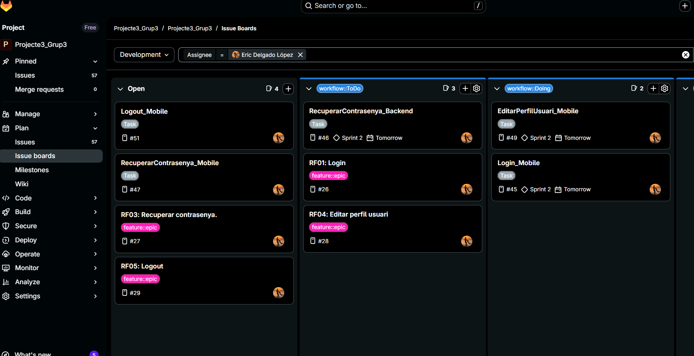
==== Board inicial — Oriol Jové Naranjo
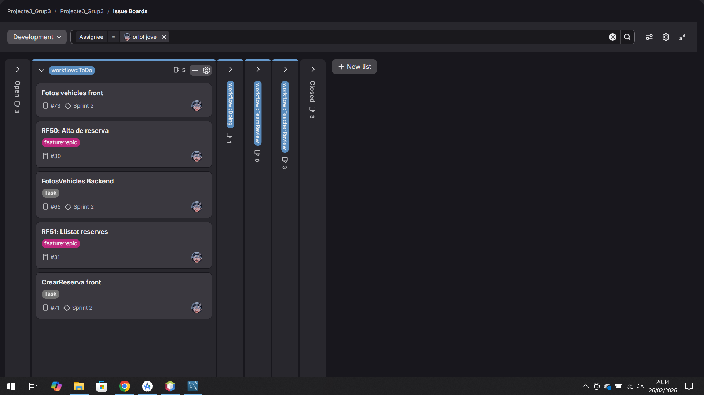

==== Board inicial — Darren Escosio Leones
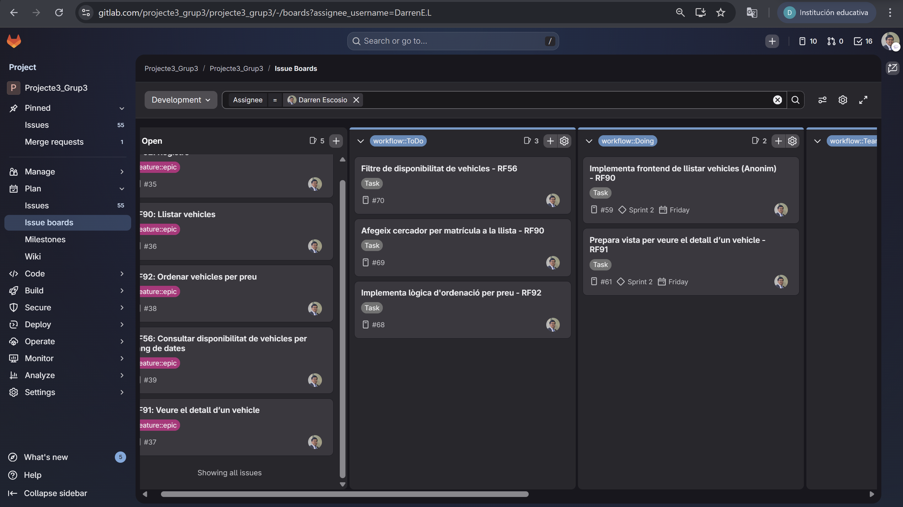

== 2. Daily Stand Ups

=== DIA 1 - 20/02
[cols="1,2,2,2,1", options="header"]
|===
| Membre | Què va fer ahir | Què farà avui | Problemes | Hores
| Eric Delgado | |Corregir errors que han surgit a la correcció del Sprint i organitzarme per el Sprint 2 | Que hi hagi molts conflictes alhora de fer el merge | 5h
| Oriol Jové | | Corregir errors que han surgit a la correcció del Sprint i afegir les imatges del vehicle al backend i al front | Que no es veuen les imatges quan executa l'aplicació | 5h + 2h
| Darren Escosio | Finalitzar el Sprint 1| Començar i fer el set up del AppNavigation con Jetpack Compose.| Vaig pasarme la majoria del temps aprenent Jetpack Compose| 6 + 2h 
|===

=== DIA 2 - 23/02
[cols="1,2,2,2,1", options="header"]
|===
| Membre | Què va fer ahir | Què farà avui | Problemes | Hores
| Eric Delgado |Vaig Corregir errors que han surgit a la correcció del Sprint i organitzarme per el Sprint 2 |Començar a fer el Login a la aplicació del frontend |Que hi hagi molts conflictes alhora de fer el merge | 4h + 2h
| Oriol Jové | Corregir errors que havien aparegut a l'Sprint i començar amb implementació de les imatges dels vehicles | Acabar d'implementar les imatges dels vehicles | He tingut un problema amb el git al fer un merge i s'ha perdut tot el que hi havia fet de les imatges dels vehicles | 6h + 2h
| Darren Escosio | Fer el set up del AppNavigation amb Jetpack Compose y modificar la MainActivity a Android Studio per fer-lo compatible| Intentar acabar el backend del RF90 i el frontend (Tasques separades)| He instalat Postman per poder analitzar millor les dades de les JSON files.| 6h
|===

=== DIA 3 - 24/02
[cols="1,2,2,2,1", options="header"]
|===
| Membre | Què va fer ahir | Què farà avui | Problemes | Hores
| Eric Delgado |Vaig començar a fer el Login a la aplicació del frontend |res |Que hi hagi molts conflictes alhora de fer el merge | 0h 
| Oriol Jové | Acabar la implementació de les imatges al frontend | Començar amb la funciomaotat de crear una reserva d'un vehicle al front | La navegació entre les pantalles de crear la reserva | 2h
| Darren Escosio |Res |Res |Cap | 0h
|===

=== DIA 4 - 25/02
[cols="1,2,2,2,1", options="header"]
|===
| Membre | Què va fer ahir | Què farà avui | Problemes | Hores
| Eric Delgado |res |Acabaré d'implementar el login a la aplicació del frontend | Que hi hagi molts conflictes alhora de fer el merge | 3h + 3h 
| Oriol Jové | Començar la funcionalitat de crear una reserva  | Acabar la funcionalitat de reserva | No se on col·locar el botó per donar d'alta una reserva per a que la navegació sigui clara | 3h + 2h
| Darren Escosio | Res|Afegir funcionalitat als botons per filtrar per matricula, preu i disponibilitat. Millora el frontend i afegir les traduccions per anglés, català i castellà | Va haber un merge conflict on vaig gran entre els meus canvis i els del Oriol, ja que va implementar la logica per mostrar imatges.| 3 + 2:30h
|===

=== DIA 5 - 26/02
[cols="1,2,2,2,1", options="header"]
|===
| Membre | Què va fer ahir | Què farà avui | Problemes | Hores
| Eric Delgado |Vaig acabar d'implementar el login a la aplicació del frontend |Començar i acabar la implementació del login y editarPerfil de l'aplicació frontend | Els problemes dels merge (conflictes)| 4h + 5h 
| Oriol Jové | Seguir amb la funcionalitat de crear una reserva | Acabar la funcionalitat de donar d'alta una reserva | La validació de les dates  | 4h + 2h
| Darren Escosio |Acabar d'arreglar el els canvis del merge conflict amb un hotfix | Començar a fer l'apartat de registre i connectar els botons per a la página de registre | 4 + 1h | 
|===

== 3. Planificació Final

=== 3.1. Planificació (Final de Sprint)

==== Board final — Grup 3
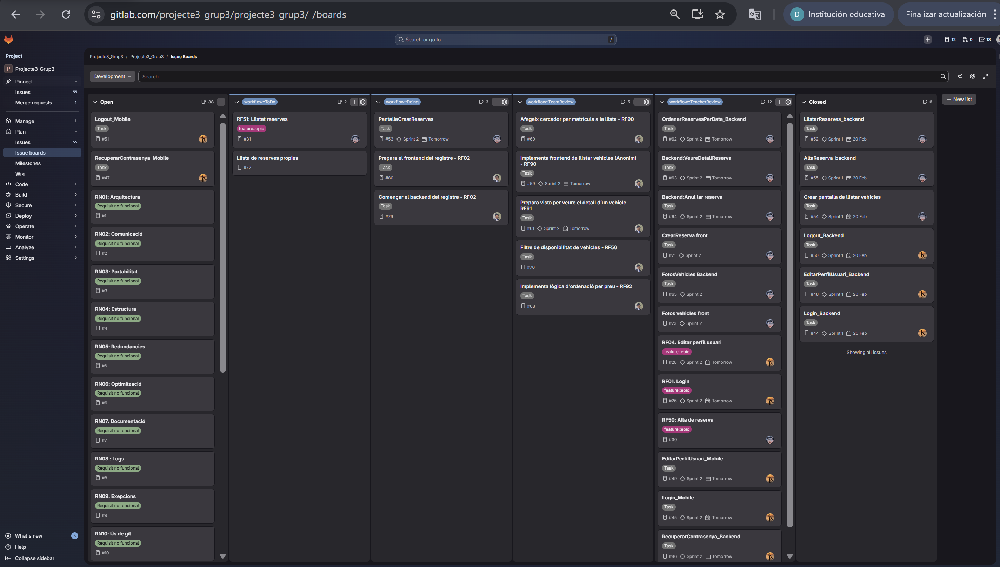
== 4. Retrospective Meeting

[cols="1,4"]
|===
|Durant aquest sprint hem estat centrats principalment en la correcció d’errors trobats en l’sprint anterior i en l’inici del desenvolupament de funcionalitats del frontend, especialment el login, el registre i la creació de reserves. També hem treballat en la implementació de les imatges dels vehicles, la navegació amb Jetpack Compose i la millora del frontend amb filtres i traduccions.

Un dels aspectes que més ha marcat aquest sprint han estat els conflictes de merge. En diversos moments, els canvis simultanis en funcionalitats relacionades (especialment en la gestió d’imatges i navegació) han provocat pèrdues de feina o necessitat de fer hotfixes. Això ens ha fet adonar que necessitem coordinar millor les branques i comunicar-nos abans de modificar parts sensibles del projecte. Tot i aquestes dificultats, hem après a gestionar millor els conflictes i a utilitzar eines com Postman per validar les dades del backend.

A nivell tècnic, també hem trobat reptes importants, com la navegació entre pantalles en Android amb Jetpack Compose, la validació de dates en la creació de reserves i la correcta visualització de les imatges. En alguns dies la productivitat ha estat menor, ja sigui per bloquejos tècnics o per acumulació de problemes derivats dels conflictes de repositori.

Malgrat tot, el sprint ha estat positiu en termes d’aprenentatge. Hem avançat en la integració entre backend i frontend, hem consolidat la funcionalitat de login i hem progressat en la creació de reserves. També hem millorat la nostra capacitat de resolució de problemes i d’adaptació davant errors inesperats.

De cara als següents sprints, ens proposem millorar la coordinació en l’ús de Git, planificar millor les tasques que afecten fitxers compartits i comunicar amb més antelació els canvis importants. Considerem que, si millorem aquests aspectes organitzatius, podrem augmentar significativament la nostra eficiència i reduir el temps dedicat a solucionar conflictes.

En conclusió, aquest sprint ha estat exigent. Tot i les dificultats tècniques i els conflictes de repositori, hem fet avenços rellevants i hem guanyat experiència que ens ajudarà a treballar de manera més coordinada i eficient en les properes iteracions.|
|===

== SPRINT - 3

=== 1. Planificació Inicial

==== Board inicial — Eric Delgado López
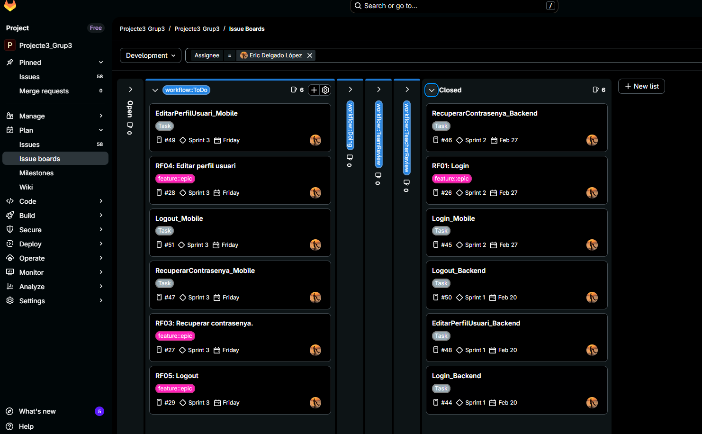

==== Board inicial — Oriol Jové Naranjo
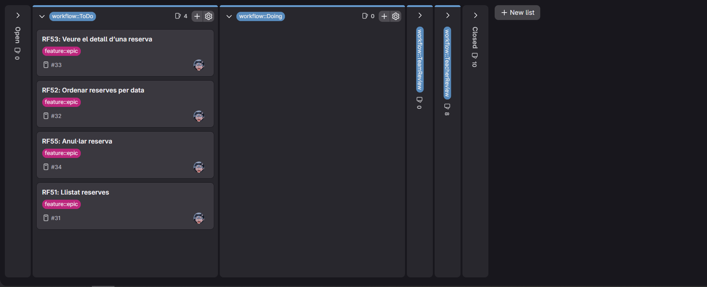

==== Board inicial — Darren Escosio Leones
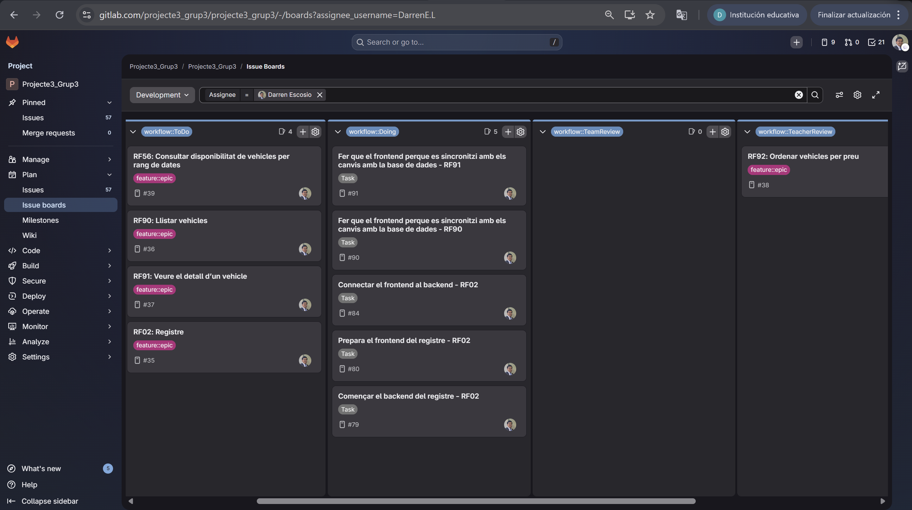

=== 2. Daily Stand Ups

=== DIA 1 - 27/02
[cols="1,2,2,2,1", options="header"]
|===
| Membre | Què va fer ahir | Què farà avui | Problemes | Hores
| Eric Delgado |Acabar coses per poder fer la correció de l'SPRINT 2 |Solucionar Errors que surtin a la correció | Que hi hagi errors al dia de l'Sprint  | 3h
| Oriol Jové | | Correcció d'errors que apareguin a la revisió del sprint 2 i acabar la funcionalitat de llistar les reserves propies | Vaig tenir un problema amb el git que no es va fer bé el merge i faltaben canvis de la meva branca i vaig haver d'arreglar-lo | 4h + 3h
| Darren Escosio | Deixar les coses preparades per a la correció del Sprint 2 | Deixar les coses preparades per a la correció del Sprint 2 |-|3h
|===

=== DIA 2 - 02/03
[cols="1,2,2,2,1", options="header"]
|===
| Membre | Què va fer ahir | Què farà avui | Problemes | Hores
| Eric Delgado |Vaig començar a solucionar l'error que les dades que s'editaven en la part Front-end s'editaven a la base de dades|Continuaré solucionant l'error del dia 27/02 |Que hi hagi errors al dia de l'Sprint, és a dir que no executi | 4h
| Oriol Jové | Acabar la funcionalitat de llistar reserves propies | Començar a fer la funcionalitat de ordenar les reserves per dates d'aquestes i veure detall d'una reserva  | | 6h + 2h
| Darren Escosio | Corregir els problemes que van surgir durant la correcció del sprint 2|Corregir els problemes que van surgir durant la correcció del sprint 2 |Durant un merge, el codi al develop de la meva part va deixar de funcionar |6h
|===

=== DIA 3 - 03/03
[cols="1,2,2,2,1", options="header"]
|===
| Membre | Què va fer ahir | Què farà avui | Problemes | Hores
| Eric Delgado |Vaig començar a solucionar l'error que les dades que s'editaven en la part Front-end s'editaven a la base de dades|Acabaré el RF04-Editar perfil usuari, la part de front-end i la part del Back-end |Que hi hagi errors al dia de l'Sprint, és a dir que no executi | 1h + 3h
| Oriol Jové | Les funcionalitats de ordenar per dates les reserves i veure el detall d'una completes | Fer la funcionalitat d'anul·lar reserves | A l'hora d'anul·lar una reserva el vehicle no tornar a estar disponible | 2h
| Darren Escosio | Llistar els errors i començar a millorar el codi de llistar vehicles perquè s'actualitzi automàticament cuan hi hagi canvis a la base de dades| -| -| -
|===

=== DIA 4 - 04/03
[cols="1,2,2,2,1", options="header"]
|===
| Membre | Què va fer ahir | Què farà avui | Problemes | Hores
| Eric Delgado |Vaig acabar el RF04-Editar perfil usuari, la part de front-end i la part del Back-end |Començaré la part de Front-end del RF05-Logout|Que hi hagi errors al dia de l'Sprint, és a dir que no executi | 0h + 2h
| Oriol Jové | Començar a fer la funcionalitat d'anul·lar reserva | Acabar la funcionalitat d'anul·lar les reserves i millorar la funcionaltat d'alta reserva que no estaba molt ben feta(només cumplia amb els requisits) |  | 3h + 3h
| Darren Escosio | -| Experimentar i acabar el llistat de vehicles i detalls dels vehicles|Va haver un merge catastrofic ja que els fitchers on estava treballant van ser modificats. Vaig hver de crear multiples branques fins que vaig poder combinar els codis problematics en branques experiment | 3 + 3h
|===

=== DIA 5 - 05/03
[cols="1,2,2,2,1", options="header"]
|===
| Membre | Què va fer ahir | Què farà avui | Problemes | Hores
| Eric Delgado |Vaig començar el RF05, la part de Front-end |Acabaré  la part de Front-end del RF05-Logout i començaré i acabaré el RF03 el front-end|Que hi hagi errors al dia de l'Sprint, és a dir que no executi | 4h + 4h 
| Oriol Jové | Acabar anul·lar reserves i millorar alta reserva | Pasaré tots els text harcodejats a String i fer laas traduccions a CAT/ESP/ANG i cambiar l'icona de l'aplicació|  | 4h + 2h
| Darren Escosio | Arreglar els errors i acabar el llistat de vehicles i detalls dels vehicles|Començar i acabar el registre de clients | cap|3 + 2h 
|===

=== 3. Planificació Final

==== Board Final — Eric Delgado López
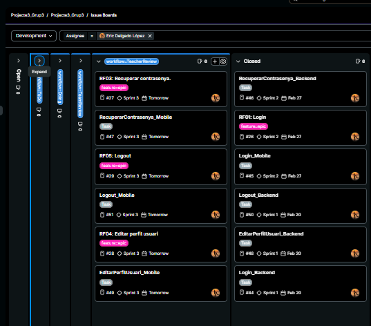

==== Board Final — Oriol Jové Naranjo
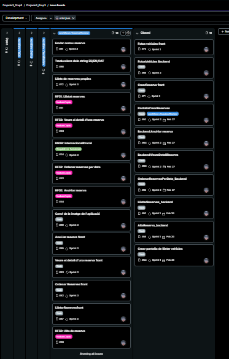

==== Board Final — Darren Escosio Leones
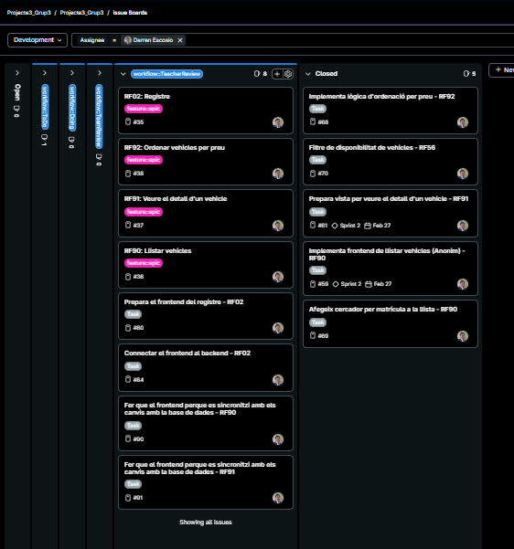

=== 4. Retrospective Meeting

[cols="1,4"]
|===
|Durant aquest sprint ens hem centrat principalment en la correcció d’errors detectats durant la revisió de l’sprint anterior i en la millora de diverses funcionalitats de l’aplicació. Hem treballat en aspectes com la gestió de reserves (llistat, ordenació per dates, detall i anul·lació), l’edició del perfil d’usuari, el logout i la millora del registre de clients. Paral·lelament, també s’han fet millores en el llistat i detall de vehicles i s’han introduït ajustos relacionats amb la internacionalització de l’aplicació i elements visuals.

Un dels aspectes que més ha condicionat aquest sprint han estat els problemes amb el control de versions. En diversos moments s’han produït conflictes de merge que han provocat pèrdua temporal de canvis o errors en el codi integrat a la branca develop. En algun cas ha estat necessari crear branques experimentals o aplicar solucions alternatives per poder recuperar i integrar correctament el treball realitzat. Aquesta situació ens ha fet veure la importància de coordinar millor els canvis i revisar amb més cura el procés d’integració del codi.

A nivell tècnic també han aparegut alguns problemes funcionals, com ara la disponibilitat dels vehicles després d’anul·lar una reserva o errors en l’edició de dades des del frontend que afectaven la base de dades. Tot i això, aquests problemes s’han anat resolent progressivament i han permès millorar la robustesa de les funcionalitats implementades.

Malgrat les dificultats, el sprint ha estat positiu en termes de progrés. S’han completat diverses funcionalitats importants i s’ha avançat en la qualitat del codi i en la integració entre backend i frontend. També s’ha millorat la comprensió del funcionament del projecte i la manera de gestionar incidències tècniques durant el desenvolupament.

De cara als següents sprints, l’equip considera necessari reforçar la coordinació en l’ús de Git, planificar millor les modificacions que afecten fitxers compartits i continuar realitzant proves funcionals de manera constant per detectar errors abans de les revisions. Amb aquestes millores, esperem poder treballar amb més estabilitat i eficiència en les pròximes iteracions.

En conclusió, aquest sprint ha estat exigent però també molt útil per consolidar funcionalitats i millorar la nostra manera de treballar en equip. Tot i els problemes amb els conflictes de repositori i alguns errors tècnics, hem continuat avançant en el desenvolupament del projecte i hem adquirit més experiència en la gestió del desenvolupament col·laboratiu.|
|===